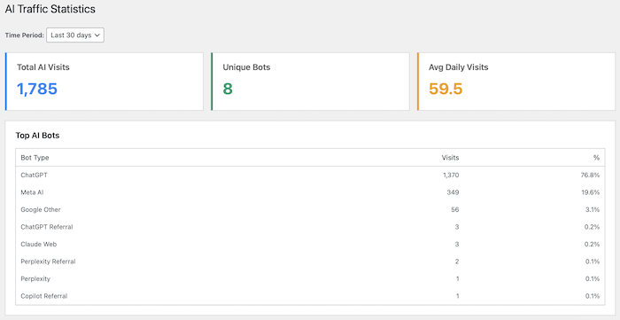
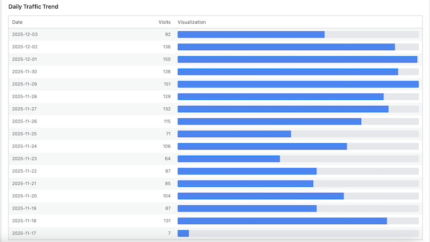
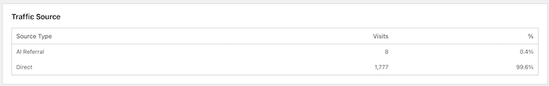

# 🤖 WP AI Traffic Logger

**Track AI bots visiting your WordPress website — simple, privacy-friendly, and performance-optimized!**

---

## 📖 What Does This Plugin Do?

Have you ever wondered if AI chatbots like ChatGPT, Claude, or Google Gemini are visiting your website? This plugin helps you find out!

**WP AI Traffic Logger** automatically detects and logs when AI bots visit your WordPress site. It tracks which pages they view, when they visit, and which AI service sent them. Think of it as a visitor log book specifically for AI bots.

### Why Would You Want This?

- **Understand AI Traffic**: See which AI services are crawling your content
- **Track Your Reach**: Know if your content is being used by popular AI chatbots
- **Monitor Trends**: Discover which pages AI bots find most interesting
- **Privacy-Focused**: All data is stored on your server, not sent anywhere else

---

## ✨ Key Features

### 🎯 Simple to Use

No complicated setup required! Install, activate, and it starts working automatically.

### 🔒 Privacy First

- IP addresses are securely hashed (scrambled) for privacy
- GDPR-friendly by default
- All data stays on your WordPress site
- You can disable IP logging completely if you prefer

### ⚡ Performance Optimized

- Uses batch processing (groups multiple visits together)
- Won't slow down your website
- Processes logs every 5 minutes in the background
- Minimal database impact

### 🤖 Detects 15+ AI Bots

Automatically recognizes traffic from:

- **ChatGPT / OpenAI**
- **Claude (Anthropic)**
- **Google Gemini**
- **Perplexity**
- **Grok (xAI)**
- **Meta AI**
- **Apple Intelligence**
- **Bing Chat / Copilot**
- **You.com**
- **Poe**
- **Phind**
- And more!

---

## 🚀 Getting Started

### Installation

1. **Upload the Plugin**

   - Download the plugin file (`wp-ai-traffic-logger.php`)
   - In your WordPress admin panel, go to **Plugins → Add New**
   - Click **Upload Plugin** at the top
   - Choose the file and click **Install Now**
   - Click **Activate**

2. **That's It!**
   - The plugin starts working immediately
   - Check your first logs by going to **AI Traffic** in your WordPress menu

### First Steps

After activation, you'll see a new **"AI Traffic"** menu item in your WordPress admin sidebar. Here you can:

- View all AI bot visits
- See statistics and trends
- Adjust settings to your preferences

---

## 📊 Understanding Your Dashboard

### 1. **Logs Page** (Main View)

This is where you see every AI bot visit to your website.

**What You'll See:**

- **Date & Time**: When the bot visited
- **Bot Type**: Which AI service (like "ChatGPT" or "Claude")
- **User Agent**: The technical identifier of the bot
- **Referrer**: Where the visit came from (if available)
- **URL**: Which page on your site they visited

**Filtering Your Logs:**

- **By Bot Type**: See visits from only one AI service
- **By Date Range**: Look at specific time periods
- **Apply Filters**: Click to filter, or Reset to see everything

**Clearing Logs:**
You can delete all logs at any time using the "Clear All Logs" button.

### 2. **Statistics Page**

Visual overview of your AI traffic patterns.

**Quick Stats Cards:**

- **Total AI Visits**: How many times AI bots visited overall
- **Unique Bots**: How many different AI services visited
- **Avg Daily Visits**: Average visits per day

**Charts Available:**

- **Top AI Bots**: Which AI services visit most often (with percentages)

- **Daily Traffic Trend**: Day-by-day visit counts with visual bars

- **Traffic Source**: Direct bot visits vs. visits from AI referrals

**Time Period Filter:**
Choose to view stats for:

- Last 7 days
- Last 30 days (default)
- Last 90 days
- Last year

### 3. **Settings Page**

Customize how the plugin works for your needs.

---

## ⚙️ Settings Explained

### Enable Logging

**What it does:** Master on/off switch for the entire plugin

- ✅ **Checked** (Default): Plugin is active and logging AI visits
- ❌ **Unchecked**: Plugin stops logging (useful for temporarily pausing)

**When to change:** Turn off if you want to pause logging without deactivating the plugin.

---

### Log IP Hash

**What it does:** Stores a scrambled version of visitor IP addresses

- ✅ **Checked** (Default): IP addresses are hashed (one-way encryption) and stored
- ❌ **Unchecked**: No IP information is stored at all

**Why scrambled (hashed)?**

- Original IP addresses cannot be recovered
- Still allows you to identify repeat visits
- Complies with privacy regulations like GDPR

**When to change:** Uncheck if you prefer not to store any IP information, even in hashed form.

---

### Sampling Rate

**What it does:** Controls what percentage of AI visits to log

- **Default:** 100% (log everything)
- **Range:** 1% to 100%

**Example:**

- At 100%, all AI visits are logged
- At 50%, only half of AI visits are logged (randomly selected)
- At 10%, only 1 in 10 visits are logged

**When to change:**

- Lower this if you have very high AI traffic and want to reduce database size
- Most sites should keep this at 100%

---

### Log Retention

**What it does:** Automatically deletes old logs after a set number of days

- **Default:** 90 days
- **Range:** 0 days to unlimited
- **Set to 0:** Keeps logs forever (not recommended for active sites)

**How it works:**
Every day, the plugin automatically removes logs older than your specified number of days.

**When to change:**

- **High traffic sites:** Use 30-60 days to keep database lean
- **Low traffic sites:** Can use 180+ days for longer historical data
- **Privacy-focused:** Use shorter periods (7-30 days)

---

## 💡 Common Questions

### "Is this plugin free?"

Yes! It's completely free and open-source (MIT License).

### "Will this slow down my website?"

No! The plugin uses batch processing, meaning it collects visit data quickly and processes it later in the background. Your site visitors won't notice any difference.

### "Where is the data stored?"

All data is stored in your WordPress database. Nothing is sent to external servers.

### "Is this legal / GDPR compliant?"

Yes! IP addresses are hashed (scrambled) by default, making them anonymous. You can also disable IP logging entirely. The plugin follows privacy best practices.

### "Can I see which exact IP address visited?"

No, because IP addresses are hashed (one-way encrypted). This is intentional for privacy protection. You can only see if the same hashed IP visits multiple times.

### "Do I need technical knowledge to use this?"

Not at all! The plugin works automatically after activation. The settings are optional and clearly explained.

### "How often is data updated?"

Logs are processed in batches every 5 minutes. So you might see a small delay before new visits appear in your logs.

### "Can I export the data?"

Currently, you can view and filter data within WordPress. You can manually copy data from the tables, or use standard WordPress database export tools.

---

## 🛠️ System Information Panel

On the Settings page, you'll find technical details:

- **Database Table**: Shows the table name where logs are stored
- **Batch Processing**: Confirms the 5-minute processing schedule
- **Queue Status**: Shows if there are pending logs waiting to be processed
- **Next Cleanup**: Shows when old logs will be automatically deleted

**This information is helpful if:**

- You want to verify the plugin is working correctly
- You're troubleshooting any issues
- You need technical details for your hosting provider

---

## 🔧 Troubleshooting

### "I don't see any logs"

**Possible reasons:**

1. **No AI bots have visited yet** — This is normal! AI bots don't visit every site frequently. Give it a few days.
2. **Logging is disabled** — Check Settings and make sure "Enable Logging" is checked
3. **Cron not running** — Logs process every 5 minutes. Wait a few minutes after a visit for logs to appear

### "Queue shows pending entries but no logs appear"

**Solution:**
WordPress cron might not be running properly. You can:

1. Wait up to 5 minutes for automatic processing
2. Visit any page on your site to trigger WordPress cron
3. Contact your hosting provider if the issue persists

### "Too many logs / Database getting large"

**Solutions:**

1. Lower the **Sampling Rate** to log fewer visits (e.g., 50% or 25%)
2. Reduce **Log Retention** to delete logs sooner (e.g., 30 days instead of 90)
3. Use "Clear All Logs" button to manually delete old data

---

## 📋 Technical Requirements

- **WordPress:** 5.0 or higher
- **PHP:** 8.1 or higher
- **Database:** MySQL (standard WordPress database)

These requirements are met by most modern WordPress hosting. If you're unsure, your hosting provider can confirm.

---

## 🤝 Support & Contributing

### Need Help?

- Check the **Common Questions** section above
- Review the **Troubleshooting** guide
- Visit the [GitHub repository](https://github.com/shpyo/wp-ai-traffic-logger) for issues and discussions

### Found a Bug?

Please report it on the [GitHub Issues page](https://github.com/shpyo/wp-ai-traffic-logger/issues)

### Want to Contribute?

Contributions are welcome! Visit the [GitHub repository](https://github.com/shpyo/wp-ai-traffic-logger) to:

- Report bugs
- Suggest new features
- Submit improvements
- Help with documentation

---

## 📄 License

This plugin is released under the **MIT License** — free to use, modify, and distribute.

---

## 👨‍💻 Developer

Created by **Piotr Cichosz**

- GitHub: [@shpyo](https://github.com/shpyo)
- Plugin: [WP AI Traffic Logger](https://github.com/shpyo/wp-ai-traffic-logger)

---

## 🎉 Thank You!

Thank you for using WP AI Traffic Logger! We hope this plugin helps you understand and track AI bot traffic on your WordPress site.

If you find it useful, please consider:

- ⭐ Starring the project on GitHub
- 📢 Sharing it with other WordPress users
- 💬 Providing feedback to help improve it

---

**Version:** 1.0.0  
**Last Updated:** December 2025
